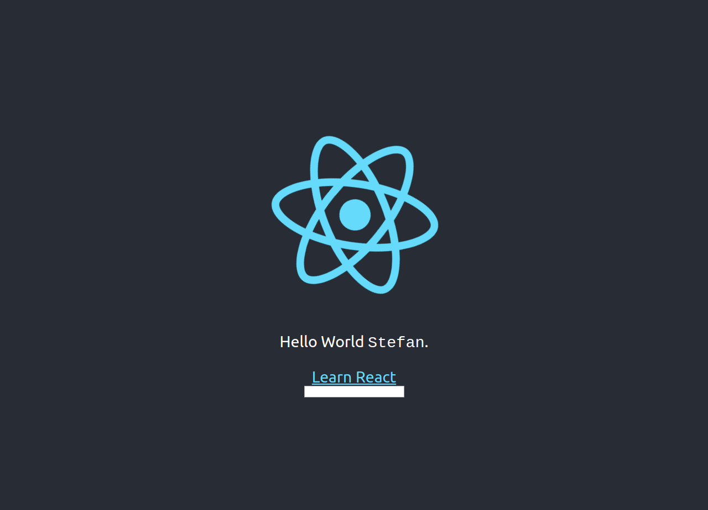

# myfirstreactapp

This project was created by Stefan Klinkusch at Digital Career Institute in Berlin, Germany using React.js.

## Steps
- a project was created using `npx create-react-app myfirstreactapp`
- the logo and the message are split into different files `Logo.js` and `Message.js`
- `Logo.js` contains a functional component
- `Message.js` contains the message, the link, and an additional input field
- the message was modified such that it contains the text from the input field or a default text if no input is given

## Screenshot

